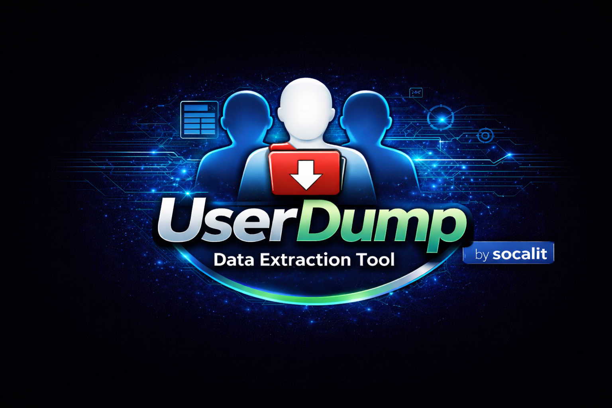

# userdump

Why “userdump”?

Because it does exactly what it sounds like: dumps the current user's data to a safe place. Portable. Fast. No fluff.
A batch script to back up the currently logged-in user profile.  
Works on everything from Windows XP to 11.

---

Features
- Full `%USERPROFILE%` backup (Desktop, Documents, AppData, etc.)
- USB and network path support
- XP to Win11 compatibility
- No software install needed — just double-click and dump

---

Usage
1. Plug in a USB or connect to a network share
2. Run `userdump.bat`
3. Follow the prompt to choose a destination
4. Let the dump happen. It’s clean. It’s fast.

---

Output Structure 
\User_files_backup\%username%\%computername%"

---

Powered by [https://github.com/socalit](https://github.com/socalit)
